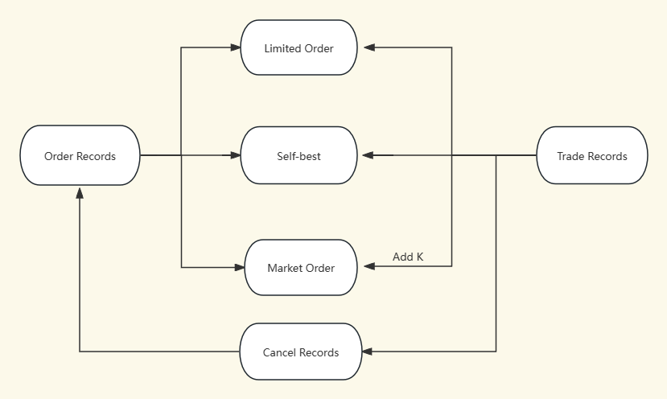

# STA321-Project  
The stock market plays a pivotal role in the global economy, acting as a hub for buyers and sellers to negotiate and execute trades. This paper explores the utilization of HDFS and MapReduce to efficiently process and analyze vast amounts of stock market data. Given the complex nature of market operations, which include a variety of order types and the continuous influx and execution of trades, there's a need for a system that can not only handle the sheer volume of data but also deliver precise and actionable trading information.

In this study, we outline our method of processing stock market data, focusing on the continuous marketing sessions during which orders and trades are dynamically recorded. Our objective is to create a sorted output file from the order and trade data, categorizing records into market orders, limited orders, self-best orders, and canceled orders, each with specific attributes such as time, price, size, and order type. We confront the challenges presented by the different outputs required for each order type and propose solutions to ensure data integrity and processing efficiency.

In the subsequent sections, we will delve into the difficulties encountered in labeling market order types, the varying outputs for different order types, and the strategies implemented to enhance performance. We will also describe the architecture of our processing system, including the role of mappers and reducers in our MapReduce framework and the rationale behind our sorting module.

    

